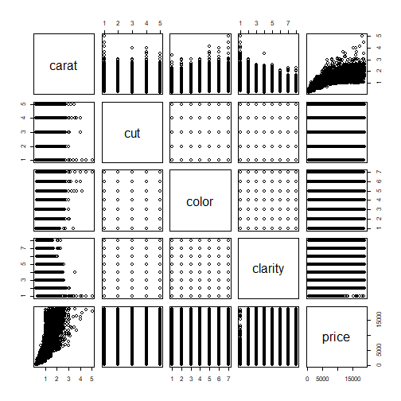

Developing Data Products - Week 4 Course Project
========================================================
author: Sachin S Pai
date: November 4th 2022
autosize: true
width: 1600
height: 900

Introduction
========================================================
Have you ever wondered how diamonds are priced beyond the number of carats(or weight)? Price also depends on the diamond's cut, color, and clarity.
- Cut: quality of the diamond from best to worst (Ideal, Premium, Very Good, Good, Fair)
- Color: best(D) to worst(J)
- Clarity: measures how clear the diamond is from best to worst (IF, VVS2, VVS1, VS2, VS1, SI2, SI1, I1)

This shiny app will predict diamond price based on your input of these factors

Documentation
========================================================
Here is a summary of the "diamonds" dataset found in the ggplot2 R package. As you can see, the factors were measured in over 50,000 diamonds

```
tibble [53,940 x 5] (S3: tbl_df/tbl/data.frame)
 $ carat  : num [1:53940] 0.23 0.21 0.23 0.29 0.31 0.24 0.24 0.26 0.22 0.23 ...
 $ cut    : Ord.factor w/ 5 levels "Fair"<"Good"<..: 5 4 2 4 2 3 3 3 1 3 ...
 $ color  : Ord.factor w/ 7 levels "D"<"E"<"F"<"G"<..: 2 2 2 6 7 7 6 5 2 5 ...
 $ clarity: Ord.factor w/ 8 levels "I1"<"SI2"<"SI1"<..: 2 3 5 4 2 6 7 3 4 5 ...
 $ price  : int [1:53940] 326 326 327 334 335 336 336 337 337 338 ...
```

Summary plot of the diamond data with each of the relevant variables plotted against each other
========================================================


Links
========================================================
- shiny app: https://lisabags.shinyapps.io/my_app/
- source code: https://github.com/LisaBags/Developing-Data-Products-Project
